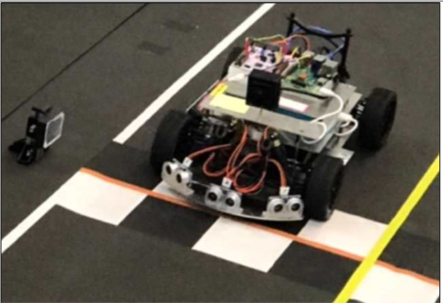
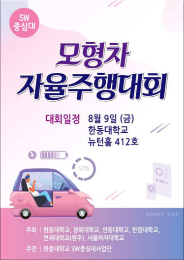

# HGU smartCarCamp

### Autonomous Driving
- ROS
- OpenCV
- C++

[자이트론의 차량](http://xytron.co.kr/?page_id=504) 을 사용하여 프로젝트를 진행
### Driving

### A competition using this model.

`camera_on.cpp` 
- when debug **without** display

`camera_show.cpp`
- when debug with display

`mailbox.cpp`
- send control signal to Motor (Speed, Angle)
